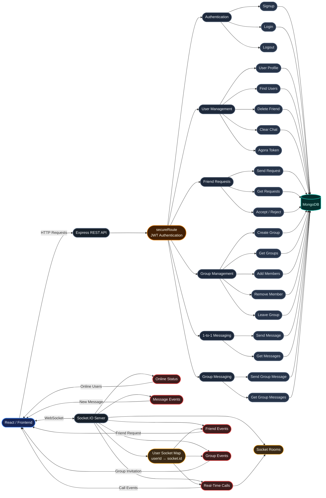

# 💬 Talkzilla – Real-Time Chat & Communication Platform

> A full-stack real-time communication platform that enables users to connect with friends, exchange messages, create groups, send group messages, and make real-time audio/video calls.

---

## 🚀 What is Talkzilla?

Talkzilla is a full-stack real-time communication platform designed to provide a seamless messaging and calling experience.

The platform allows users to:

- 👤 Create and manage their accounts
- 🔍 Search and discover other users
- 🤝 Send and manage friend requests
- 💬 Exchange one-to-one messages
- 👥 Create and manage groups
- ➕ Add and remove group members
- 📨 Send group messages
- 📞 Make real-time audio/video calls
- 🟢 Track online users
- 🔔 Receive real-time friend and group notifications
- 🔐 Access protected resources through JWT authentication
- 🗑️ Manage friends and clear conversations

Talkzilla combines **REST APIs** for persistent application operations with **Socket.IO** for real-time communication and **Agora** for audio/video calling.

---

## ✨ Features

### 👤 User Management

- User registration
- User login and logout
- User profile retrieval and editing
- Search users by username
- Retrieve users
- Delete user account
- Friend management
- Clear chat history

### 🤝 Friend System

- Send friend requests
- View incoming friend requests
- Accept or reject friend requests
- Delete friends
- Real-time friend request notifications
- Real-time friend addition notifications
- Real-time friend deletion notifications

### 💬 One-to-One Messaging

- Send private messages
- Retrieve conversation history
- Persistent message storage
- Real-time communication
- Clear conversations

### 👥 Group Management

- Create groups
- Retrieve groups
- Add group members
- Remove group members
- Leave groups
- Group membership management

### 📨 Group Messaging

- Send messages inside groups
- Retrieve group message history
- Real-time group communication
- Group invitation notifications

### 📞 Real-Time Calling

- Audio/video calling
- Agora-powered communication
- Call request signaling
- Call rejection handling
- Call termination events
- Socket.IO room management

### 🟢 Online Presence

- Track currently online users
- Real-time online user updates
- Socket-based user identification
- Automatic cleanup when users disconnect

### 🔐 Security

- JWT-based authentication
- Protected API routes
- Authentication middleware
- User-specific resource access

---

## 🏗️ System Architecture



---

## 🔌 REST API Modules

### Authentication

| Method | Endpoint | Description |
|---|---|---|
| `POST` | `/signup` | Create a new account |
| `POST` | `/login` | Login user |
| `POST` | `/logout` | Logout user |

### User Management

| Method | Endpoint | Description |
|---|---|---|
| `GET` | `/getUserProfile` | Get authenticated user's profile |
| `POST` | `/edit` | Edit user profile |
| `POST` | `/delete` | Delete user account |
| `POST` | `/findUsers` | Search users |
| `POST` | `/getUsers` | Retrieve users |
| `POST` | `/generate-token` | Generate Agora token |
| `POST` | `/confirmDeleteAccount` | Confirm account deletion |
| `POST` | `/deleteFriend` | Delete a friend |
| `POST` | `/clearChat` | Clear chat |

### Friend Requests

| Method | Endpoint | Description |
|---|---|---|
| `POST` | `/sendFriendRequest` | Send friend request |
| `POST` | `/getRequests` | Get friend requests |
| `POST` | `/handleRequestSubmits` | Accept or reject request |

### Groups

| Method | Endpoint | Description |
|---|---|---|
| `POST` | `/createGroup` | Create a group |
| `GET` | `/getGroups` | Get user's groups |
| `POST` | `/removeGroupMember` | Remove group member |
| `POST` | `/addGroupMembers` | Add group members |
| `POST` | `/leaveGroup` | Leave a group |

### Private Messages

| Method | Endpoint | Description |
|---|---|---|
| `POST` | `/send/:id` | Send private message |
| `GET` | `/get/:id` | Get conversation |

### Group Messages

| Method | Endpoint | Description |
|---|---|---|
| `POST` | `/sendGroupMessage` | Send group message |
| `POST` | `/getGroupMessage` | Get group messages |

> Protected endpoints use the `secureRoute` authentication middleware.

---

## ⚡ Socket.IO Events

| Event | Purpose |
|---|---|
| `connection` | Establish a Socket.IO connection |
| `disconnect` | Remove disconnected user |
| `getOnline` | Broadcast online users |
| `join-room` | Join a Socket.IO room |
| `request-join-room` | Request a user to join a call |
| `call-ended` | Notify users that a call ended |
| `call-rejected` | Notify caller that a call was rejected |
| `send-friend-request` | Send a real-time friend request |
| `receive-friend-request` | Receive a friend request notification |
| `add-new-friend` | Notify about a newly added friend |
| `friend-delete` | Notify about friend removal |
| `request-group-join-room` | Send group invitation |
| `send-join-requrst` | Notify users about a join request |

---

## 🧰 Tech Stack

| Layer | Technology |
|---|---|
| Frontend | React.js |
| Build Tool | Vite |
| Styling | Tailwind CSS |
| Backend | Node.js + Express.js |
| Real-Time Communication | Socket.IO |
| Database | MongoDB |
| Authentication | JWT |
| Video / Audio Calling | Agora |
| API Communication | REST API |
| State Management | React Context / State Management |
| File Handling | Multer |
| Development | Nodemon |

---

## 📁 Project Structure

```text
Talkzilla/
│
├── Backend/
│   │
│   ├── controller/                  # Application business logic
│   │   ├── user.controller.js
│   │   ├── message.controller.js
│   │   ├── friendRequest.controller.js
│   │   ├── group.controller.js
│   │   └── groupMessage.controller.js
│   │
│   ├── jwt/                         # JWT authentication utilities
│   │
│   ├── middleware/                  # Authentication middleware
│   │   └── secureRoute.js
│   │
│   ├── models/                      # MongoDB models
│   │
│   ├── route/                       # Express API routes
│   │   ├── user.route.js
│   │   ├── message.route.js
│   │   ├── friendRequest.route.js
│   │   ├── group.route.js
│   │   └── groupMessage.route.js
│   │
│   ├── SocketIO/                    # Socket.IO server
│   │
│   ├── uploads/                     # Uploaded files
│   │
│   ├── .env                         # Environment variables
│   ├── environment.js               # Environment configuration
│   ├── index.js                     # Backend entry point
│   ├── package.json
│   └── package-lock.json
│
├── frontend/
│   │
│   ├── public/                      # Static assets
│   │
│   ├── src/
│   │   ├── assets/                  # Images and static resources
│   │   ├── components/              # Reusable UI components
│   │   ├── context/                 # React Context
│   │   ├── Home/                    # Main application screens
│   │   ├── lib/                     # Utility functions
│   │   ├── stateManage/             # Application state management
│   │   ├── App.jsx                  # Root React component
│   │   ├── environment.js           # Frontend environment configuration
│   │   ├── index.css                # Global styles
│   │   └── main.jsx                 # React entry point
│   │
│   ├── index.html
│   ├── package.json
│   ├── package-lock.json
│   ├── eslint.config.js
│   ├── postcss.config.js
│   ├── tailwind.config.js
│   ├── vite.config.js
│   └── README.md
│
├── .gitignore
└── README.md
```

---

## 🔐 Authentication Flow

Talkzilla protects user-specific resources using JWT authentication.

```text
Client
  │
  ▼
Login / Signup
  │
  ▼
JWT Authentication
  │
  ▼
secureRoute Middleware
  │
  ├── Valid Token ──► Protected Controller
  │
  └── Invalid Token ─► Unauthorized Response
```

---

## 📞 Calling

Talkzilla uses **Agora** for real-time audio/video communication and **Socket.IO** for call signaling.

### Socket.IO handles

- Call requests
- Call rejection
- Call termination
- Room joining
- Identifying connected users

### Agora handles

- Audio communication
- Video communication
- Real-time media streaming

---

## ⚙️ Getting Started

### Prerequisites

Make sure the following are installed:

- Node.js 18+
- npm
- MongoDB / MongoDB Atlas
- Git
- Agora account and credentials

---

## 📥 Installation

Clone the repository:

```bash
git clone https://github.com/AyushMishra-2005/Talkzilla.git
```

Navigate into the project:

```bash
cd Talkzilla
```

---

## 🖥️ Backend Setup

```bash
cd Backend
npm install
```

Create a `.env` file:

```env
PORT=
MONGODB_URI=
JWT_SECRET_KEY=
APP_CERTIFICATE=
APP_ID=
CLOUDINARY_API_KEY=
CLOUDINARY_API_SECRET=
CLOUDINARY_CLOUD_NAME=
```

Start the backend:

```bash
npm run dev
```

---

## 🌐 Frontend Setup

Open another terminal:

```bash
cd frontend
npm install
```

Configure the frontend environment variables according to your backend configuration.

Start the frontend:

```bash
npm run dev
```

The application will be available at:

```text
http://localhost:5173
```

---

## 🛡️ Security

Talkzilla uses protected routes to ensure that private resources are accessible only to authenticated users.

Protected functionality includes:

- User profiles
- Profile editing
- User search
- Friend operations
- Friend requests
- Groups
- Messages
- Agora token generation
- Account management

---

## 📊 Project Highlights

| Feature | Implementation |
|---|---|
| Authentication | JWT |
| Private Chat | REST + Socket.IO |
| Group Chat | REST + Socket.IO |
| Friend Requests | REST + Socket.IO |
| Online Presence | Socket.IO |
| Calling | Agora |
| Database | MongoDB |
| Backend | Express + Node.js |
| Frontend | React + Vite |
| Styling | Tailwind CSS |
| API Security | secureRoute Middleware |
| Real-Time Communication | Socket.IO |

---

## 👨‍💻 Author

**Ayush Mishra**

B.Tech Computer Science & Engineering

---

## 📄 License

This project is developed for educational and project purposes.
